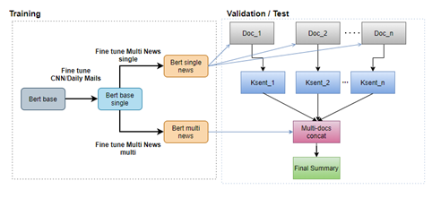
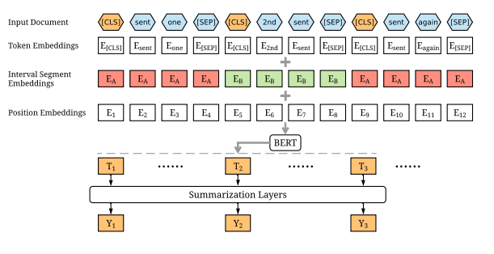

# MultiBertS
Phương pháp phân cấp cho bài toán tóm tắt đa văn bản, thử nghiệm trên bộ dữ liệu Multi News

Kết quả đạt SOTA trên bộ dữ liệu Multi News

Cải tiến so với các nghiên cứu hiện có:
  - Cải thiện vấn đề ít dữ liệu bằng cách sử dụng thêm dữ liệu bài toán tóm tắt đơn văn bản
  - Tối đa thông tin đầu vào của mô hình bằng cách thiết kế phương pháp phân cấp
  - Tối ưu quá trình training: sử dụng [Label Smoothing](https://arxiv.org/pdf/1701.06548.pdf) giúp mô hình giảm overfit
  - Sử dụng kỹ thuật loại bỏ câu trùng lặp trong văn bản tóm tắt
## Tổng quan luồng xử lý:

## Quá trình training:
**Quá trình training gồm 3 bước**:
1. Fine-tune mô hình trên bộ dữ liệu đơn văn bản (CNN/Daily Mails) ([pretrained single CNN/Daily Mails](https://drive.google.com/drive/folders/1d4fuGfRuFmMcWUTdMsm9ukRqXlizLk45?usp=sharing))
2. Fine-tune mô hình trên dữ liệu trích rút đơn văn bản bộ Multi News ([pretrain single Multi News](https://drive.google.com/drive/folders/13QTGaC8mvRtvcr4fvAOCjn03reF3dTNT?usp=sharing))
3. Fine-tune mô hình trên dữ liệu trích rút đa văn bản bộ Multi News ([pretrained multi Multi News](https://drive.google.com/drive/folders/1--5BIzcSeprEP99jbf9m8nJHplqU8pmA?usp=sharing))

## Chuẩn bị dữ liệu
**Phương pháp tạo dữ liệu trích rút từ dữ liệu tóm lược gốc**
1. Phương pháp chọn tổ hợp
  - Chọn ra tổ hợp câu có độ đo ROUGE 1 cao nhất trong tất cả tổ hợp câu có thể (2^n)
3. Phương pháp chọn tham lam
  - Một câu sẽ được thêm vào danh sách các câu đã chọn nếu làm tăng ROUGE 1 của danh sách đó

## Xây dựng mô hình
**Fine tune BERT cho bài toán tóm tắt văn bản**

Trong đó, Summarization Layer có thể là:
1. Classifier: logistic regession
2. BiLSTM: sử dụng BiLSTM để học được mối quan hệ mức câu, sau đó là phân loại logistic
3. Transformer encoder: giống với BiLSTM, dùng Attention để Encode thay vì LSTM

## Quá trình thử nghiệm
1. Xử lý dữ liệu, chi tiết trong file [Data_processing](./src/notebook/Data_processing.ipynb):
  - Cắt ngắn văn bản (lấy 512 token đầu tiên)
  - Tạo dữ liệu trích rút từ dữ liệu tóm lược
  - Xử lý tổng hợp câu từ các đơn văn bản
  - ...
3. Training, evaluate mô hình, chi tiết trong file [MultiBertS_training_evaluation_final_clean](./src/notebook/MultiBertS_training_evaluation_final_clean.ipynb):
  - Training BERT + Classifier (CNN/Daily Mails + single|multi Multi News)
  - Training BERT + BiLSTM (CNN/Daily Mails + single|multi Multi News)
  - Training BERT + Transformer (CNN/Daily Mails + single|multi Multi News)
  - Evaluate valid, test, view tensorboard logs...
